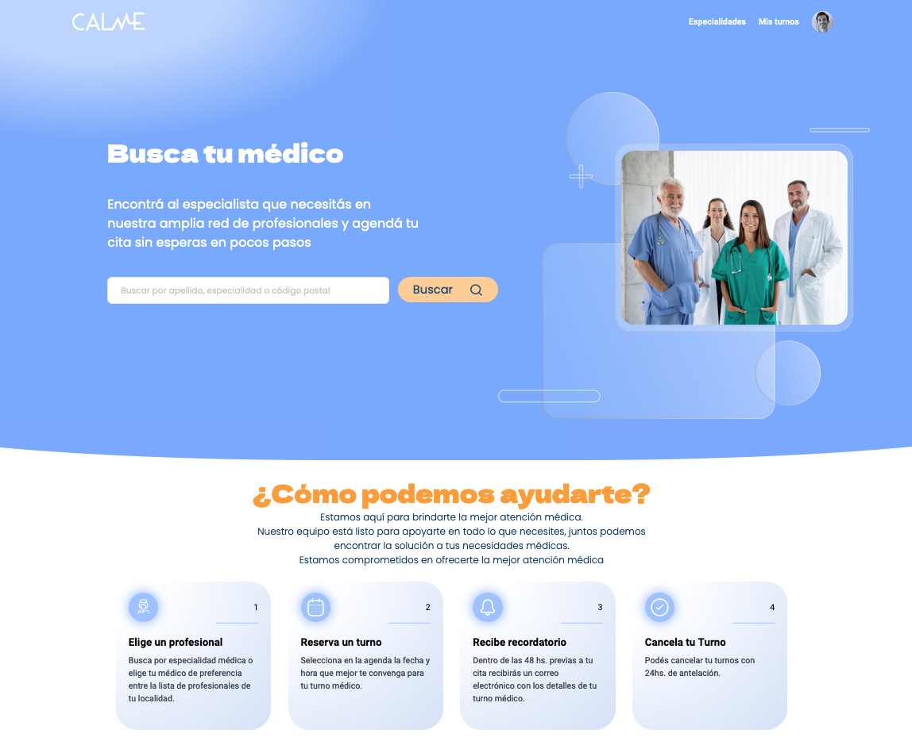
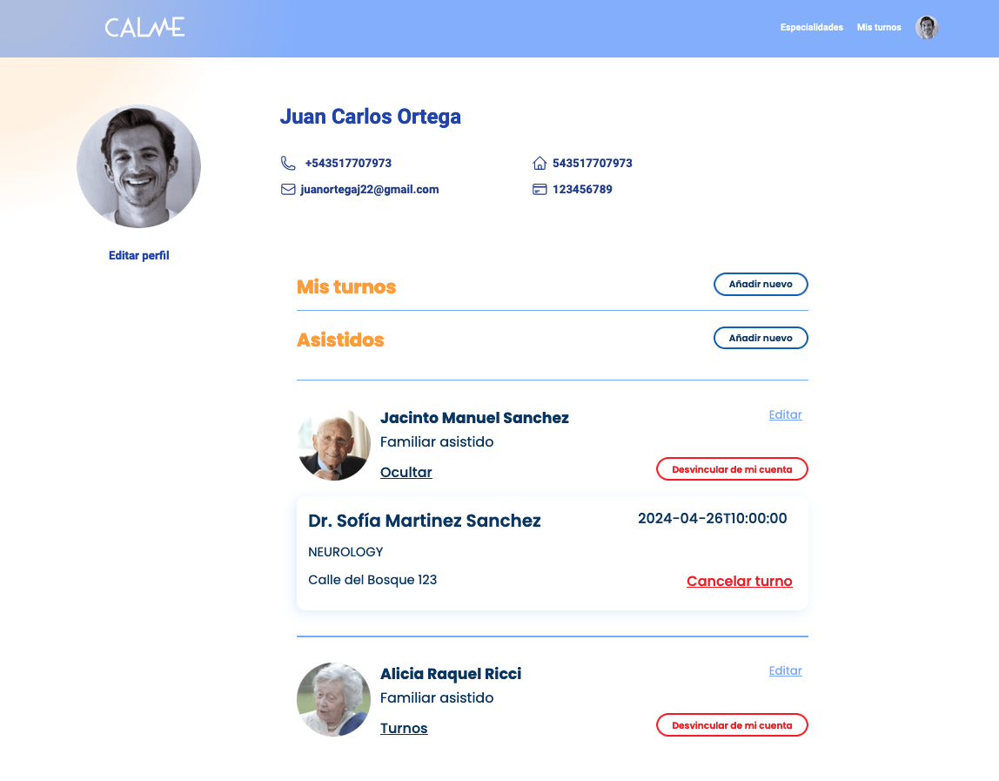

  <h2 align='center'>Este es un proyecto de la comunidad:</h2>
  

  

  

  <!-- PROJECT LOGO -->
  

    
  

  

  <h1 align='center'>Online medical appointment scheduler</h1>
    <h2 align='center'><strong>We assist you while you assist those who need you.</strong></h2>

Calme is the solution for individuals tasked with managing online medical appointments for others.  
As a patient, you can access our professional directory and schedule appointments.  
Furthermore, you can also add the individuals under your care and request, review, and cancel their appointments.  
The app will remind you of the appointment via email and WhatsApp 48 hours in advance.  
Additionally, Calme provides an electronic agenda for viewing daily appointments for healthcare professionals.
    
Throughout the 5 weeks of product development presented in the MVP, the team adhered to SCRUM, diligently participating in all the ceremonies to enhance our adaptability to unforeseen circumstances and obstacles.
      

 

Calme es la solución para las personas que tienen que asistir a otras en la gestión de turnos médicos online.  
Como paciente, podés consultar nuestra cartilla profesional y sacar turnos, pero además podés anexar a las personas que tengas a cargo y solicitar, revisar y cancelar los turnos de ellas.   
La app te recordará el turno via email y whatsapp con 48hs de anticipación.  
Por otro lado, como profesional de la salud, Calme dispone de agenda electrónica para poder ver día a día los turnos dados.
  
Durante las 5 semanas de desarrollo del producto presentado en el MVP, el equipo se ciñó a SCRUM, atravesando las diversas ceremonias con puntualidad para potenciar nuestra adaptabilidad ante los diversos imprevistos y obstáculos.

<section id='tech-stack'>
  <h1> Tecnologias Usadas </h1>
**Front:** Angular, TypeScript, Tailwind
  <h2>Front-End</h2>

  <h2>BacK-End</h2>
  

 

 

**Design:** Figma
  <h2> Organización </h2>
  
  

  

***Incluir video que pasó Vane***

  

## 🔗 Deployment
 

### Client: https://s14-10-m-java.web.app/
### Server: [Swagger](https://s14-10-m-java-production.up.railway.app/swagger-ui/index.html#/)
### Design: [Figma](https://figma.com/file/5ZKP1KyKwLW4vfkJbBZolz/Proyecto?type=design&node-id=330-153&mode=design&t=KKqaD6BxMKy2RTEm-0)
  

## 🙌 Equipo: s14-10-m-java
 

### UX/UI
 

 Antonella Staffolani

Vanesa Casaubon
  

### Frontend
 

 Elcira Ibarra

 Felix Andres Betancur Sanchez

 Facundo La Bionda

 Juan Oscco

 Alexis Oroya

 

### Backend
 

 Guillermo Diván

 Juan Ortega

 Nicolás Sepertino

 Lucas Von Elm

 Lucía Romano

 Néstor Duque

 Alexis Alejandro Calderón

 Agustin Gomez
  

### Project Manager
 

 Guillermo Diván
  

### QA Tester
 

 Iván Karnos
